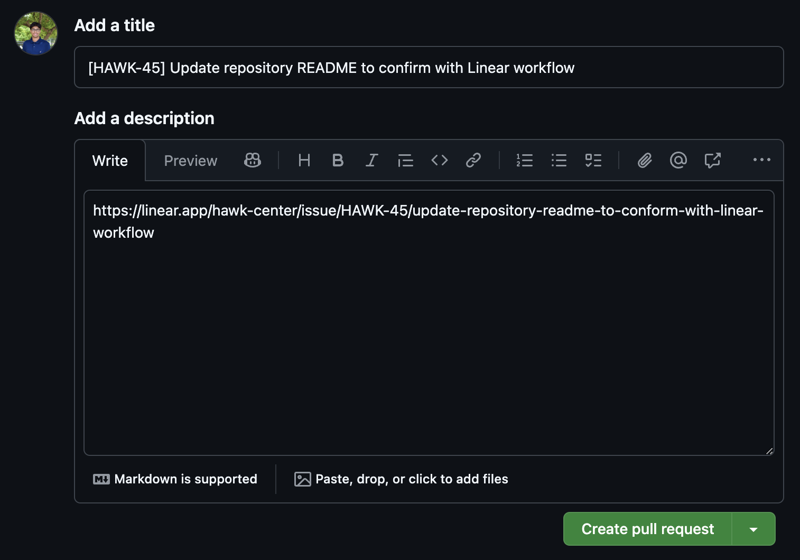

# Contributing Guidelines & Workflow

## How do I contribute?

The general rule of thumb is that any change you're making to a repository should be associated with a ticket in Linear. If not, create a ticket to do so. Exceptions to this rule include hotfixes and minor bug fixes.

#### Steps to contribute:

1. Clone the repository.
2. Create a new branch. The branch name can either be your name or a name related to the ticket you are working on. Keep it short (<30 characters).
3. Immediately make an empty commit and create a pull request. This will allow the team to know that you are working on a ticket.
   - The PR name should follow this convention: `[<ticket-id>] <ticket-name>` and be marked as draft.
     - The ticket ID will automatically link the PR to the ticket through the Linear integration.
   - Example: `[HAWK-45] Update repository README to conform with Linear workflow`.
   - The first description should be the link to the Linear ticket. Refer to the screenshots below.
   - 
   - 
4. Commit often and push/pull frequently. This will allow the team to see your progress. Furthermore, it will help you in case you need to revert back to a previous state.
5. After you have received adequate review and feedback, squash your commits and merge your branch into the main branch.

## Style Guide

### Documentation

Comprehensive documentation is essential to ensure that future team members can efficiently debug and refactor our codebase. Clear and well-maintained documentation facilitates understanding, promotes consistency, and enhances overall project maintainability.

Example:

```python
"""
@description: Summary of what the file is
@author: [FIRST NAME] [LAST NAME]
    
"""

def sample_function(var: str) -> str:
    
    """Description of what the function does.

    :param var: Description of the parameter.
    :return: Description of the return value.
    """
    
    print(var)
    return var
    
    # Inline comments to summarize more complex code
```

### Styling

Before pushing code run the following commands to ensure that the code is compliant with the typing standards:

```bash
mypy .
```

**Notes:**

1. Type-Annotate Code: Add type annotations to function signatures and variables to make the code more self-explanatory and to help catch potential issues early. For example, def greet(name: str) -> str:.
2. PEP8-Compliant 80-Char Max per Line: Follow the PEP8 style guide and keep lines to a maximum of 80 characters. This improves readability and ensures consistency across the codebase.

If you are using an LLM to write code for you, adding these instructions will usually get you code compliant with the above:
```
use type-annotations, sphinx-style docstrings, and pep8 compliant max 80 chars per line.
```
